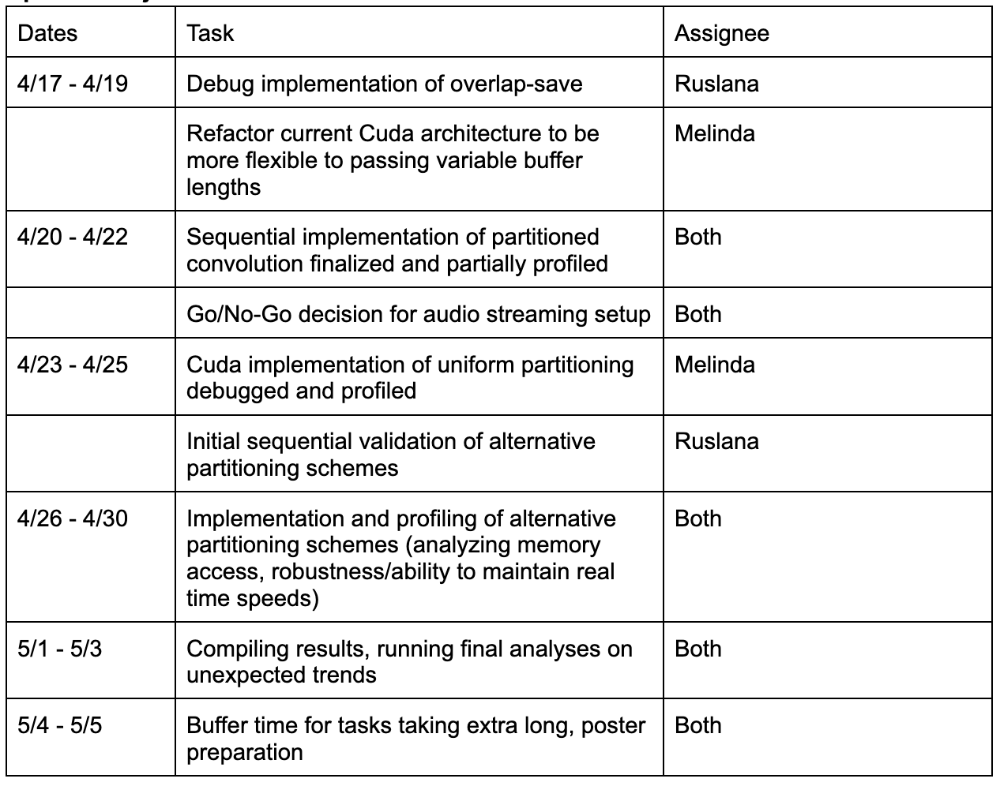

# Milestone Report 

## PDF Report: 

## Updated Schedule: 

## Progess so far:

We have the architecture set up to read in and process audio using the AudioFile C++ library. We have also implemented some simpler audio processing algorithms (i.e. increasing the gain of a file, linear convolution with an impulse response) both sequentially and in CUDA to validate that our current pipeline works. A sample output of a short EDM soundbyte convolved with a ringing impulse response using CUDA can be found at [this link](https://drive.google.com/file/d/1gicM4vWrc8Jfzuce3yt2FCPAoLrJA7NA/view?usp=drive_link). 

We also have an preliminary implementation of sequential overlap-save (which we are still in the process of debugging) which will become the basis for our CUDA implementations of uniform and non-uniform partitioned convolutions. We also plan on using this sequential implementation to compare all our different parallel implementations to. 

## Updated Goals and Deliverables:

We are mostly on track to hit the deliverable of having a partitioning algorithm implemented in CUDA which we can then profile in terms of work distribution, memory access, and overall speed. However, given that it is quite difficult to ‘stream’ audio in real time over an SSH connection, and we are currently working using the GHC machines, we anticipate that it will be very difficult to characterize the ‘real-time’ robustness of our algorithms. Thus, we will focus more of our current profiling efforts on overall speed of algorithm while simultaneously looking into ways to accurately characterize the real time performance of our algorithms with our current setup (i.e. setting up some form of timestamping or logging outputs to compare latency between different partition implementations). 

Our new goals are as follows:
- Implementation of partitioned audio convolution with profiling information (work distribution, overall time, bandwidth, memory access) for the different types of partitions
- Analysis of the ‘real-time’ performance of partition strategies by looking at consistency of timestamped outputs
- Stretch goal: demo of different partitioning schemes performance, allowing the audience to pass in an audio file and receive a convoluted output

At the poster session, we plan on having figures which compare the performance of multiple partitioning strategies on the GPU. The current set of approaches we are considering comparing include: naive linear convolution, uniform partitioning, non-uniform partitioning based purely on meeting real-time deadlines, and non-uniform partitioning based pre-analysis of the input sound. The metrics we will compare include: work distribution, overall time, memory access characteristics, and some measure of real-time performance (which will depend on how successful we are at getting a real-time streaming setup to work over SSH). As a stretch goal, we will also have a demo where the audience can see input audio files or audio sources getting convoluted in real time.

Currently, we don’t have much in the way of profiling results, but we do have example convoluted audio files using both sequential and CUDA implementations (linked above in the progress so far section). 

## Concerning issues:

The most concerning issue right now is the uncertainty surrounding our ability to debug ‘real-time’ performance and audio streaming. However, we have some backup strategies for this, which include writing our outputs with the timestamp, and then visually comparing when the different partitions complete processing to determine whether or not a particular algorithm functions in ‘real-time.’ Otherwise, the main challenge ahead is just implementing the algorithms and doing the profiling. 

