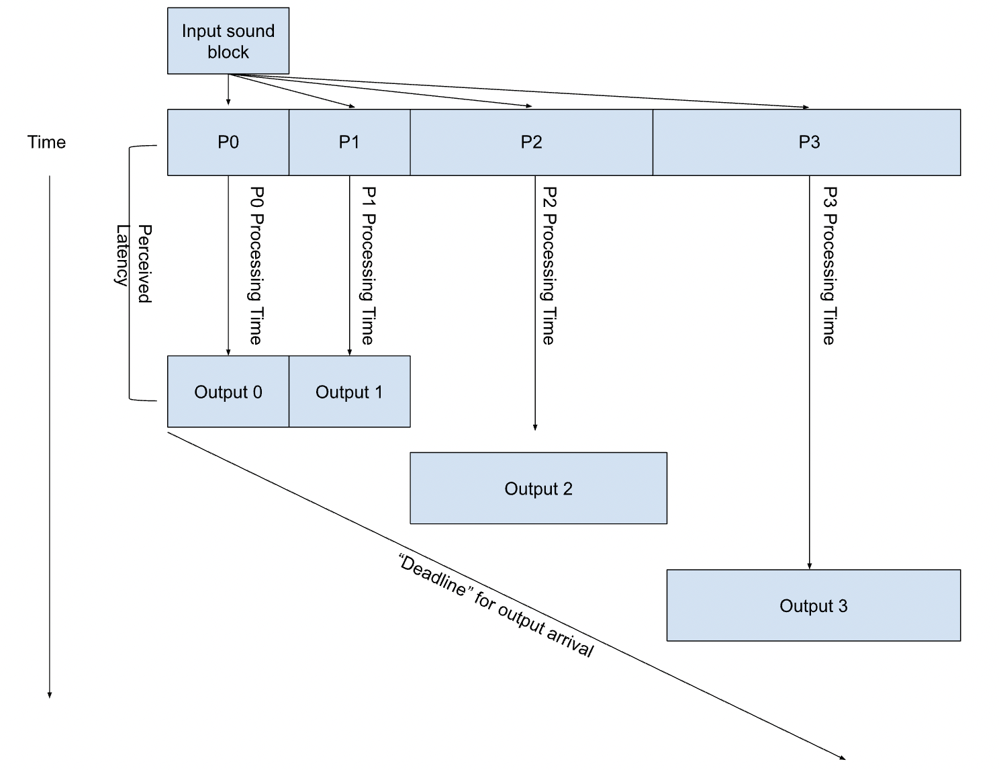
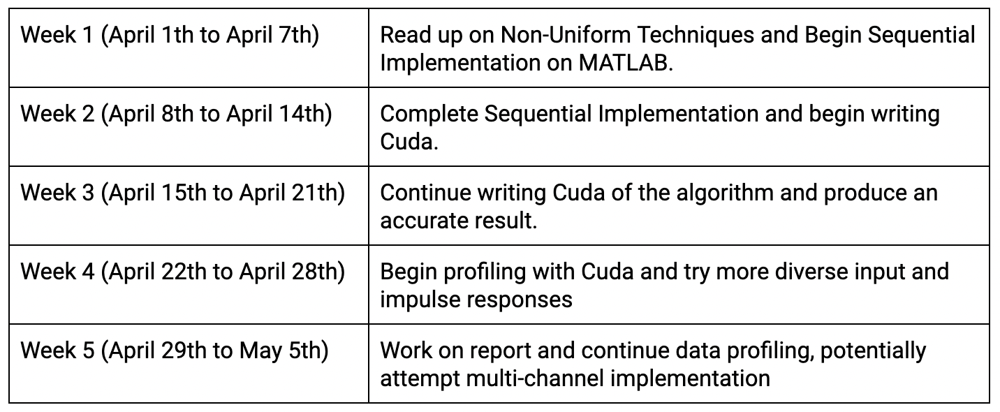

# Project Proposal

## Title: Profiling Real-Time Non-Uniformly Partitioned Audio Convolution (Melinda Chen, Ruslana Fogler)

## Milestone Report Page: [Milestone](https://csinensis.github.io/15418_Final_Project/milestone)

## Summary: 

We are going to investigate and compare different filter strategies for non-uniformly partitioned convolutions, which can be used to perform real-time audio processing. We will implement these partitioned convolutions on a GPU, focusing specifically on how partition strategy affects workload imbalance, ability to keep up with real-time constraints, and potential for latency hiding.

## Background:

### What is Audio Convolution?

Audio convolution is the mathematical process of multiplying the frequency spectra of two audio sources. This will cause shared frequency ranges to be amplified and unshared frequency ranges to be reduced, and is typically done by taking the Fast Fourier Transforms of two signals, multiplying them together, and then Inverse Fast Fourier Transforming them back. This process is heavily used in sound production and in movie, video game, or other virtual reality contexts to give the impression that a character or noise is heard in a particular environment. For example, the reverberating voices of characters speaking in a cave, 3D audio, and suitable motion-picture production audio are all produced using this algorithm. Generally, convolution for the sake of audio processing is done by multiplying the frequency spectra of an input audio signal with the spectra of a filter impulse response, allowing the input signal to take on the characteristics of the filter response’s environment.

### What has been done?

In the past decade, there have been many advancements made in parallelizing audio convolutions using GPUs. However, there is still a lot of room for improvement of real-time GPU audio processing, which continues to suffer from FFT redundancy and bandwidth expense. Researchers have looked into strategies for smartly breaking up and grouping together input signals to reduce the amount of extra work performed while staying within bounds of ‘real time’ updates. Our objective is to expand upon this work by exploring strategies of partitioned convolution algorithms on the GPU.

### What are non-uniform filter partitions?

There are two time scales that are vital to consider when performing real-time audio processing: the length of a streamed input sound block (B), and the length of the filter impulse response (N). When N is significantly larger than B, performing a naive convolution becomes inefficient since B needs to be padded to carry out matrix operations with N. 
One way to address this problem is to partition the filter impulse response into many smaller filters which have similar sizes to B and combine the smaller filtered outputs into one stream. These filter partitions also offer another axis of parallelism, as none of the smaller outputs are dependent on each other.

Partitioning the filter impulse response into equal-sized chunks is referred to as uniform filter partitioning. While this helps to reduce unnecessary padding, there is still another challenge to address with real-time audio processing, which is that there is a tradeoff between lowering input-output latency (generally achieved by decreasing the streamed sound block size, B) and increasing computational cost via more overhead.

Non-uniform filter partitioning addresses this concern by taking advantage of the fact that a partition of the impulse response starting at time t = i only starts to contribute to the output after timestep i. Thus, it is possible to maintain the same amount of input-output latency while decreasing overhead cost by making the latter blocks in the filter partition larger. As long as the amount of time it takes to process the latter partitions is less than the offset of the partition from the start of the impulse response, no additional delay will be introduced.

## Challenge:

The main challenge of this project involves partitioning and pipelining the audio convolution in a way that will allow for real-time processing. Since we are focusing specifically on non-uniform partitioning, we will have to come up with strategies to balance the workloads of these partitions. Since each partition’s ‘deadline’ for outputting a signal is dependent on the start of the partition, solving this problem becomes significantly more complex than just using dynamic assignment, because the order in which partitions are executed plays a role in maintaining the perception of ‘real-time’ processing.

### Workload:

Dependencies:

In order for an individual to perceive the output of the convolution as being in ‘real-time’ a complete output block,given some non-convoluted input sound block, must be returned within a reasonable (i.e. difficult to perceive) amount of time. This becomes much more difficult as the filter response gets longer (as explained in the background section) which we hope to address through the partitioning strategy.

Memory Access Characteristics:

Within each partition of the filter response, we are likely to have good locality, given that the partitions simply just chunk together portions of the filter response by time. However, it is possible that we will run into issues when carrying out the convolutions with the input block, since each partition will need to access the same block. Thus, we may consider either creating copies of the input block, or decreasing contention by giving priority to earlier partitions. 

### Constraints:

High Bandwidth Consumption:

The biggest challenge in real-time processing with GPUs is the CPU-GPU bandwidth transfer limitations. 
We will experience huge difficulty in trying to use input buffering to transfer meaningful amounts of data while hiding the latency

Work Assignment Variations:

Work assignment is delicate; since our partitioning goal relies on chunking up the signal into small blocks that grow increasingly larger during the duration of the real-time convolution
We need to cleverly sample our data’s amplitude at the start and assign block sizes that will feasibly compute the current input data while simultaneously computing a reasonable amount of future input data
This work assignment is highly variable depending on the nature of data we receive, so we will need to make this very adaptable for different circumstances

Synchronization Challenge:

Synchronization is tricky because you need to hide the latency of the data transfer and convolution computation because of the real-time nature of the sound and being able to have the next value in time. 
The algorithm we are profiling has a degree of time dependency, where future computations of the data will need to be ready in time as the current timestep finishes, but limited bandwidth of the GPU ensures we cannot “lookahead” to all future input values at once

## Resources:

To implement parallelized audio convolution, we will need to use Nvidia GPUs. We intend to create our code base from scratch, potentially with inspiration from 15418 assignment 2’s memory passing implementation. We will first develop a sequential working algorithm in MATLAB based on various paper implementations of Non-Uniform Partitioning, and then we will begin development in Cuda with the Thrust Library. 

We have also looked at the following resources to gain a better understanding of the theory behind what we are trying to implement:

Papers:
- Siddiq, Sadjad. “OPTIMIZATION OF CONVOLUTION REVERBERATION.” (2020).
- García, Guillermo. “Optimal Filter Partition for Efficient Convolution with Short Input/Output Delay.” Journal of The Audio Engineering Society (2002): n. Pag. 
- Wefers, Frank. (2014). Partitioned convolution algorithms for real-time auralization.  

## Goals & Deliverables:

Our main goal will be to produce the partitioning algorithm on Cuda that will perform an audio convolution of data in real time. Deliverables will include profiling of the real time audio’s work distribution, latency, and bandwidth consumption as we vary partitioning size and strategy. Since we are interested in seeing how different forms of partitioning can affect real time audio, we hope to have this algorithm support different kinds of music inputs and still be able to produce real-time accurate results. 

Ideally, we will be able to graphically demonstrate that this procedure will also have greater speedup relative to typical uniform-partitioning GPU audio strategies and our initial sequential implementation. 

Questions that would be answered include an understanding of what partitioning schemes would be best suited for handling different impulse responses or input signals. At the demo, we would present graphs detailing such discoveries and a video of our implementation’s success. 

One stretch goal for our project would be to support multi-channel audio convolution, so that the audio could be meaningfully convolved to be played on 2 speakers. This introduces some greater complexity of solving the same problem twice at a time, by handling the separate convolution against the same impulse response against two different input signals. 

Another huge stretch goal for our project would be to demonstrate our audio convolution findings in a setup during our 418 final project demo, where we pass in audio to our GPU algorithm and play back the convolved sound in real time on speakers during our presentation. 

## Platform Choice: 

We plan to take advantage of the Thrust library and C++ Cuda to write our code. The Thrust library includes Fast Fourier Transform functions, so we will be able to focus on the work distribution, partitioning, and synchronization aspects of the project. 

Using GPUs is a strong choice for this project, because it involves a large amount of pointwise multiplication against many data values at once. Similarly, we are seeking to profile and improve upon current real-time GPU audio implementations, so our project constraint is hinged on the use of GPUs. 

## Schedule:

Project Milestone due on April 16th, 2024.
Final Project Report due on May 5th, 2024. 

